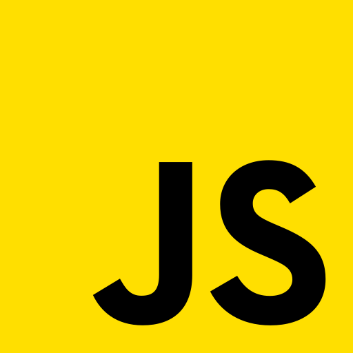
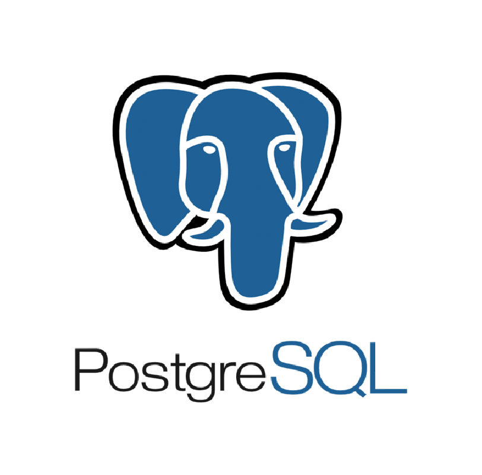

## Привет!
## Меня зовут Кирилл, я frontend-разработчик.

### Мой стек:
<!--**Languages**-->
|  |  |  |  |
| --- | --- | --- | --- |
<!--**Frameworks**-->
|  |
| --- |
<!--**Databases**-->
|  |
| --- |

### Мои инструменты:

|  |  |  |  |  |  |
| --- | --- | --- | --- | --- | --- |